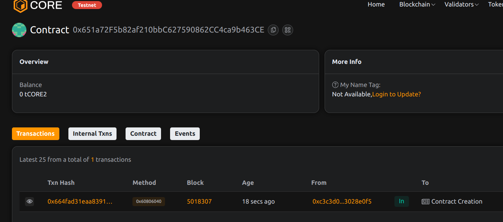

# Project Title: FlexSub: Activity-Based On-Chain Subscriptions

## Project Description

FlexSub is an on-chain subscription protocol where users must maintain activity within their subscription period to keep their subscription active. This model rewards engagement and ensures active users retain access.

## Project Vision

To create dynamic subscription services that incentivize consistent user interaction, improving retention and value for service providers and subscribers.

## Key Features

- Pay-to-subscribe with fixed fee
- Activity updates to maintain subscription validity
- Automatic expiration without activity
- Owner controls subscription fee

## Future Scope

- Integrate with NFT gating or token gating
- Tiered subscription plans
- Automated reminders or off-chain notifications
- DAO-governed fee and period adjustments

## Contract Details
0x651a72F5b82af210bbC627590862CC4ca9b463CE
